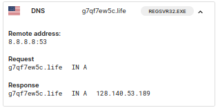
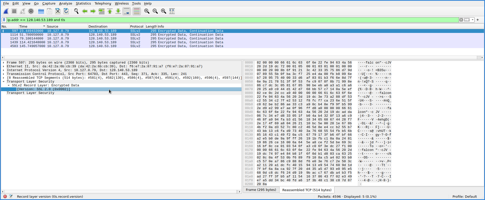

Pulling out a semi-recent malware [sample][0] associated with [Bumblebee][1] on Recorded Future's tria.ge platform for further analysis yielded a novel raw TCP socket C2 communication channel over port 443 not previously observed in previous campaigns. 

This is in stark contrast to the oldest known BumbleBee sample [VMray][2] reported that leveraged HTTP as the network protocol while the more recently observed iterations have adopted WebSockets.

1. Note the DNS A record query associated with REGSVR32.exe:
   
2. Isolating the SSLv2 conversation associated with the suspected C2 domain g7qf7ew5c[.]life (128.140.53.189) in Wireshark yielded an interesting ASCII string "falcon":
```wireshark
ip.addr == 128.140.53.189 and tls
```

3. Using Tshark to pull out frames containing the hexadecimal revealed other interesting frames:
   ```bash
$ tshark -r dump.pcap -Y "frame contains 82:00:00:00:66:61:6c:63:6f:6e" -x
0000  da 42 2a 6b cb 39 f6 e7 2a 87 91 a7 08 00 45 48   .B*k.9..*.....EH
0010  00 ae 3a 78 40 00 2e 06 50 73 80 8c 35 bd 0a 7f   ..:x@...Ps..5...
0020  00 4f 01 bb fc bf fb 89 a4 6d 73 dd 45 58 50 18   .O.......ms.EXP.
0030  01 f5 8e ca 00 00 82 00 00 00 66 61 6c 63 6f 6e   ..........falcon
0040  22 fe 94 63 4a 56 20 2d 19 dc 72 00 01 05 00 01   "..cJV -..r.....
0050  03 01 00 01 00 00 00 00 20 00 28 07 bc d2 6c fc   ........ .(...l.
0060  34 e4 e3 bb 41 98 6f e3 13 9e f3 db 68 38 ef ff   4...A.o.....h8..
0070  cf 16 08 93 99 61 d6 5c fe 19 40 00 d6 f4 c6 c2   .....a.\..@.....
0080  08 cd 2f c7 57 f7 9f aa 36 d4 5c 85 dc d1 43 4b   ../.W...6.\...CK
0090  62 74 53 47 95 96 31 f2 7c 22 12 0f 06 ab 52 88   btSG..1.|"....R.
00a0  cd 38 34 78 a8 b6 fa 34 cc 45 9f db c2 51 13 b2   .84x...4.E...Q..
00b0  0b ef 18 73 43 a9 10 5c dd 4b 4c 20               ...sC..\.KL 
[...ellipsized output...]
```
4. Interested in reproducing this raw socket chatter I copied the hex stream from Wireshark and I arrived at the following xxd netcat one-liner to successfully illicit a reply from the C2:
```bash
$ echo -n "8200000066616c636f6e22fe94634a56202d19dc720001050001030100010000000020008b6f91213c4233357586d79d0789555b0fba3cf725e4da00fbb8096eb7289575400033d6af8301b3f66e8d7f6e9a2178513f9f53fec9078f8b71998e86c7dc3c0581678590beeba0a3a1c6a62825a9c044d142d768bb57c7140a5eef82ce0c2dcca94000000066616c636f6e22fe94634a56202d19dc4aaedf7285ecd36d22cdd3c7e406c588d3c5498670217485943e24b79837a337598d763e7a3728c82eade99ab71924bea000000066616c636f6e22fe94634a56202d19dc472fbca492fb41eeafd87ed53c7693e3728b10a695b1b0ed1c438634bd4293b342443095a0b58fb9dd5591aef2c11765a794ea0d2117cdb3f7448dc79560a737ec7cc2ca8305f28c9eb23bc846f8dab5740231948284aab6f846e59e33c4ef78a69df99d7b69462ff5b5026dc9618fe360cfd39c1b43601c3198f6749ca05e393e1b38cf3a5e3726100327832e2c0ca8f100000066616c636f6e22fe94634a56202d19dcedf180b61383fe624c0f87125385d14b457d7a3acd83024a54b891b189a9f121034710e2a944676d1ae1f4abf3d8227c38e8bffe2c1cc9fd101ffb10d4e6bfc6f3853dbcd09b443c0b93e7eabc19cc58ffc277ce55210eedadf956ab23926d01ed8bf44fcb90dc74b5f7779c05ad676cf442620ee685f98cd5badd51500f7f79" \
| xxd -r -p \
| nc 128.140.53.189 443 \
| hexdump -C
00000000  82 00 00 00 66 61 6c 63  6f 6e 22 fe 94 63 4a 56  |....falcon"..cJV|
00000010  20 2d 19 dc 72 00 01 05  00 01 03 01 00 01 00 00  | -..r...........|
00000020  00 00 20 00 28 07 bc d2  6c fc 34 e4 e3 bb 41 98  |.. .(...l.4...A.|
00000030  6f e3 13 9e f3 db 68 38  ef ff cf 16 08 93 99 61  |o.....h8.......a|
00000040  d6 5c fe 19 40 00 d6 f4  c6 c2 08 cd 2f c7 57 f7  |.\..@......./.W.|
00000050  9f aa 36 d4 5c 85 dc d1  43 4b 62 74 53 47 95 96  |..6.\...CKbtSG..|
00000060  31 f2 7c 22 12 0f 06 ab  52 88 cd 38 34 78 a8 b6  |1.|"....R..84x..|
00000070  fa 34 cc 45 9f db c2 51  13 b2 0b ef 18 73 43 a9  |.4.E...Q.....sC.|
00000080  10 5c dd 4b 4c 20 40 00  00 00 66 61 6c 63 6f 6e  |.\.KL @...falcon|
00000090  22 fe 94 63 4a 56 20 2d  19 dc 8b 36 26 13 3f bb  |"..cJV -...6&.?.|
000000a0  3c 87 76 4e 32 ad 7a 9e  a2 62 ad 48 da 30 ec f9  |<.vN2.z..b.H.0..|
000000b0  e8 f1 4e 87 26 c3 13 67  2f 3a a1 13 fb bf d3 cf  |..N.&..g/:......|
000000c0  e8 d1 31 1f 8e 29 db 17  10 cb                    |..1..)....|
000000ca
```
5. Neat. Looking at what has been shared by the researchers at bin.re[3] regarding their reverse engineering attempts of the Domain Generation Algorithm (DGA) used by Bumblebee in previous campaigns let's hunt for Newly Registered .life Domains (NRDs or "baby domains") that fit our criteria. Grab the last 30 days of NRDs from whoisds.com with this loop:
   ```bash
$ $ for i in {1..30}; do
  DATE=$(date -d "$i days ago" '+%Y-%m-%d.zip')
  ENCODED=$(echo -n $DATE | base64)
  curl -s "https://www.whoisds.com/whois-database/newly-registered-domains/$ENCODED/nrd" -o "$DATE"
  unzip -p "$DATE" >> all-30d-nrd.csv
done
```
6. Next let's grep for 9-11 character .life domains:
  ```bash
$ grep -Eo '\b[A-Za-z0-9]{9,11}\.life\b' all-30d-nrd.csv | wc -l
4342
```
7. Additionally we may want to do some Shannon entropy analysis on the domains to refine the csv a bit:
   ```python
from math import log2
from collections import Counter
import csv

def shannon_entropy(s):
    length = len(s)
    counts = Counter(s)
    probabilities = [count / length for count in counts.values()]
    entropy = -sum(p * log2(p) for p in probabilities)
    return entropy

# Read domains from CSV file
filename = 'all-30d-nrd.csv'
with open(filename, 'r') as file:
    reader = csv.reader(file)
    domains = [row[0] for row in reader]

# Calculate and print entropy for each domain
for domain in domains:
    entropy = shannon_entropy(domain.replace(".", ""))
    print(f"Entropy of {domain}: {entropy}")
```

```bash
$ python3 shannon.py | grep -Eo '\b[A-Za-z0-9]{9,11}\.life\b.*' | awk -F': ' '{print $2, $1}' | sort -nr | head -10
4.237291339955158 xnbod8d9n59.life
4.237291339955158 xnbod8d9n59.life
4.148394345536403 usa354591.life
4.148394345536403 usa354591.life
4.133660689688185 xjy7s38hs.life
4.133660689688185 xjy7s38hs.life
4.088779347361362 xut3nysnv84.life
4.088779347361362 xut3nysnv84.life
4.083856189774723 xy74kin8ec9.life
4.083856189774723 xy74kin8ec9.life
```
8. Now armed with this knowledge we can create a python script (falcon_punch.py) to actively fingerprint other suspected C2 domains:
   ```python
import csv
import socket
import dns.resolver

def resolve_domain_to_ip(domain):
    try:
        resolver = dns.resolver.Resolver(configure=False)
        resolver.nameservers = ['8.8.8.8']  # Use Google DNS resolver
        result = resolver.resolve(domain, rdtype='A')

        return str(result[0])

    except (dns.resolver.NoNameservers, dns.resolver.NXDOMAIN, dns.exception.Timeout):
        return None
    except dns.resolver.NoAnswer:
        return ""

def send_request(domain_or_ip, hex_string):
    try:
        request = bytes.fromhex(hex_string)

        sock = socket.socket(socket.AF_INET, socket.SOCK_STREAM)
        sock.settimeout(30)
        sock.connect((domain_or_ip, 443))
        sock.send(request)
        response = sock.recv(4096)
        sock.close()

        hex_dump = response.hex()
        return hex_dump

    except (socket.timeout, socket.error):
        return None


hex_string = "8200000066616c636f6e22fe94634a56202d19dc720001050001030100010000000020008b6f91213c4233357586d79d0789555b0fba3cf725e4da00fbb8096eb7289575400033d6af8301b3f66e8d7f6e9a2178513f9f53fec9078f8b71998e86c7dc3c0581678590beeba0a3a1c6a62825a9c044d142d768bb57c7140a5eef82ce0c2dcca9" \ "4000000066616c636f6e22fe94634a56202d19dca1686b07393fa022cc1c8e84c0d005ac6f4cc0343b33eecaed0ce3e001e18968c6850cf177fcd259f743fd543cf7d831" \ "a100000066616c636f6e22fe94634a56202d19dc689443a33a48434c4592c1b2c3dae98cf824ba5cb30782077e5213b6298ee5e3928cbf7673623143e4aea376a765e5842e5f13eaa7c6fcf4bded5d25c4adbc3b1ca7aec44724b0e41e757b07e651c6b67a8b486fcab8f9ced9d832c28dd9587de973678021e3e68a8bbe3578aa9a1bbafa3c583007b4beef2bdfe277bea3a551cd926c4ff66f482fb5edbf681826195d52" \             "f500000066616c636f6e22fe94634a56202d19dc78885771f774e0d0291132b41c5910e606f63dda8aae27ccea6a4449a27590557e1dbc308a13891910b6e89910866917bb366f6849f1dc4699fa1fac150d907308ac171e428ffc492d1db327d275617f3223b90eec70bf4bdca72d0ca1c8bca4560356995874e5fd0a3158c38ac4f3ad66a4e92d3da98d75a8a277e0cfaf0a7135a6ca839d31530226776dc23548d47a645c3793c4e972be0def6ea86592530662b5ca56c8952f70a44c8fa9a8f29a526af1fc637ec79d3debc9270350aec8aade7b863fe84d46e695268bf826cee805c4d7e308f908a136103532c27e636391dfa1d3a402"

with open('all-30d-life-nrds.csv') as csv_file:
    csv_reader = csv.reader(csv_file, delimiter=',')
    for row in csv_reader:
        domain = row[0]
        ip = resolve_domain_to_ip(domain)

        if ip:
            response = send_request(ip, hex_string)
            if response:
                if "66616c636f6e" in response:  # Check if the hex dump contains "falcon"
                    print(f"The response for {ip} contains 'falcon'.")
            else:
                pass
                #print(f"Timeout occurred for the request to {ip}.")

```
10. Expected output below: 
  ```bash
$ python3 falcon_punch.py 
The response for 128.140.53.189 contains 'falcon'.
The response for 103.113.70.168 contains 'falcon'.
The response for 151.236.30.163 contains 'falcon'.
```
11. Sweet! We observed a couple new Bumblebee C2 .life domains and IPs to add to our list of IoCs:
  ```bash
x5fnzbct1.life: 103.113.70.168
1i2vp7bte.life: 151.236.30.163
```

Final thoughts/areas for future research: the SSLv2 implementation is an interesting choice. My initial speculation is that Bumblebee threat actors chose this deprecated SSL protocol to resist fingerprinting via TLS fingerprinting hashes like jarm,ja3, ja4 etc. FWIW I was not successful using Wireshark compiled with a custom ja3|4 dissector[4][5] nor with ja3box.py[6]

If anyone has any luck fingerprinting the SSLv2 conversation from the Tria.ge pcap[7] be sure to let me know.

## Detections
### Snort
```yaml
alert tcp any any -> any any (msg:"Bumblebee C2 Falcon Hex string detected"; content:"|66 61 6c 63 6f 6e|"; sid:100001; rev:1;)
```
### Bro/Zeek
```
event bro_init()
{
    local pattern: string = "\\x66\\x61\\x6c\\x63\\x6f\\x6e";

    Log::add_filter(HTTP, ["hex_string"]);

    event http_request_received(c: connection, method: string, path: string, version: string)
    {
        if (c$id$resp_h?$data) {
            local response = c$id$resp_h?$data;

            if (/\x66\x61\x6c\x63\x6f\x6e/.find(response))
            {
                print fmt("Bumblebee C2 Falcon Hex string detected: %s", response);
                # Add your custom actions here
            }
        }
    }
}
```
### Yara
```yara
rule detect_falcon_hex_string {
    strings:
        $hex_string = { 66 61 6c 63 6f 6e }
    condition:
        $hex_string
}
```

[0]: https://tria.ge/231009-2a2hbagg61/behavioral2
[1]:  https://malpedia.caad.fkie.fraunhofer.de/details/win.bumblebee
[2]: https://www.vmray.com/cyber-security-blog/understanding-bumblebee-the-malicious-behavior/
[3]: https://bin.re/blog/the-dga-of-bumblebee/
[4]: https://gitlab.com/wireshark/wireshark/-/merge_requests/12566
[5]: https://gitlab.com/uhei/wireshark/-/tree/ja4
[6]: https://github.com/Macr0phag3/ja3box
[7]: https://tria.ge/samples/231009-2a2hbagg61/behavioral2/dump.pcap